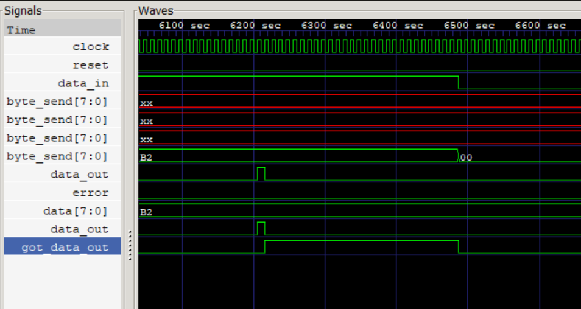
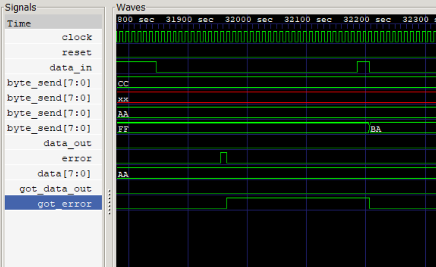
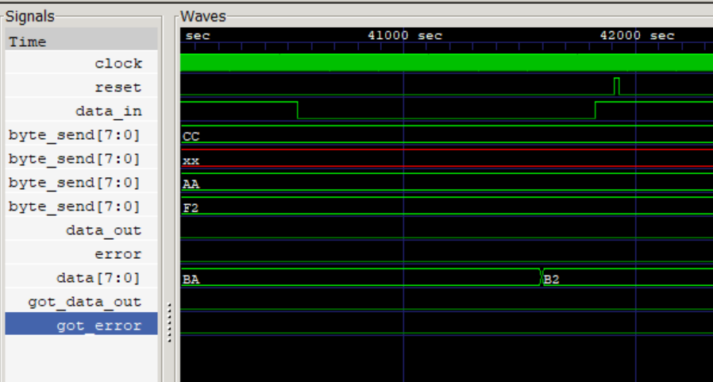
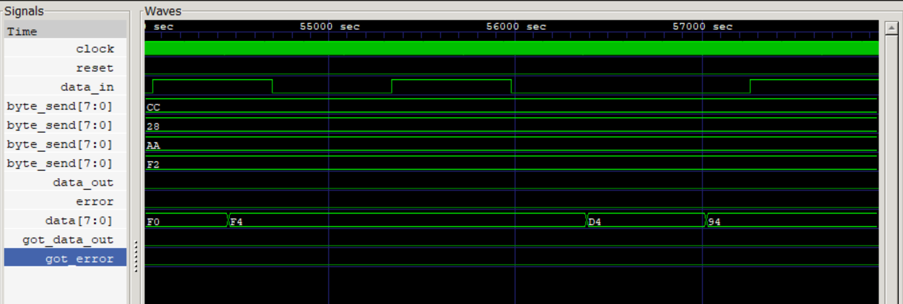

UART Receiver (RX)

The receive half of the UART project, built on top of the same baud rate generator used in the transmitter. This one was a genuinely different kind of challenge from TX. TX just has to send data on its own schedule, but RX has to figure out, from nothing, when a transmission is even starting, with no shared clock and no advance warning.

How it works

RX watches data_in continuously, every clock cycle, for a 1-to-0 transition (a possible start bit). Once it sees one, it doesn't just trust it blindly - it samples the line three times, around ticks 7, 8, and 9 of the baud generator's 16x oversampling, and takes a majority vote. If two or more of those samples say 0, it's a real start bit; if not, it was just noise, and RX goes straight back to watching.

Once a start bit is confirmed, RX moves into reading the actual 8 data bits, then the stop bit, each one sampled the same majority-vote way (three samples, take the majority). Every valid byte gets checked for a proper stop bit before it's accepted - if the stop bit doesn't check out, RX raises error instead of data_out, since that usually means the frame got corrupted or desynced somehow.

One thing that took me a while to fully get right: RX's own internal counter doesn't reset on a fixed timer, it resets right after each confirmation point. That actually turns out to matter a lot for testbench timing (more on that below).

## Files
* `UART_rx.v` - the design
* `UART_rx_tb.v` - testbench with 7 distinct test scenarios
* `baud_rate.v` - shared baud generator (same one from TX, parameterized DIVISOR)

## Interface

| Signal | Direction | Width | What it does |
|---|---|---|---|
| clock | input | 1 | system clock |
| reset | input | 1 | active-high reset |
| data_in | input | 1 | the incoming serial line |
| data | output | [7:0] | the received byte |
| data_out | output | 1 | pulses high when a byte is successfully received |
| error | output | 1 | pulses high if the stop bit didn't check out (framing error) |

## Test cases

* Normal receive, a few different byte patterns (including all-0s and all-1s as edge cases)
* A glitched data bit - deliberately flipping the value right around the receiver's actual sample window, to make sure the majority vote genuinely resolves disagreement rather than just reading whatever value happens to be there
* A glitched stop bit, to check that `error` fires correctly and `data_out` doesn't
* A false start bit - a brief dip that shouldn't survive the majority vote, checking RX correctly goes back to idle instead of getting stuck
* Reset happening mid-transmission (used `fork`/`join` for this one, to run the byte-send and the reset trigger in parallel)
* Back-to-back frames

Verified with $monitor and by walking through the actual GTKWave output. I ended up adding a couple of "sticky" registers (got_data_out, got_error) in the testbench, since data_out and error are only high for one clock cycle, and my checks weren't always landing on that exact cycle - this way the testbench catches the pulse even if it happens to check a cycle or two later.

Waveforms: 

normal transmission: data_out correctly pulses high and the received data matches what was sent on data_in.

a glitched stop bit correctly triggers error and a reset back to idle, and the very next byte sent right after is still correctly received, not stuck.

reset asserted mid-frame correctly aborts the in-progress reception and cleanly returns to idle, ready to correctly capture the next byte.

a glitched start bit occurring while a transmission is still ongoing can be misread as a new start bit, desyncing the frame and producing incorrect data — a known limitation of this simple design, not something this version handles.

Tools:
Icarus Verilog + GTKWave
