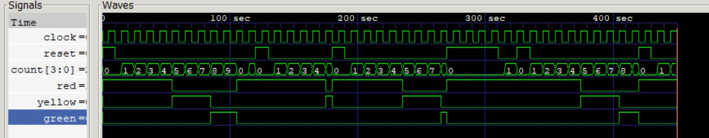

# Traffic Light Controller (Moore FSM)

A synchronous traffic light controller implemented as a Moore finite state machine in Verilog, with a self-checking testbench and full waveform verification.

## Design Overview

- Type: Moore FSM — output depends only on current state, never directly on inputs
- States: RED (0) → YELLOW (1) → GREEN (2) → back to RED, cyclic
- Timing: transitions occur at count==4 (Red→Yellow), count==7 (Yellow→Green), count==9 (Green→Red)
- Reset: active-high, forces immediate return to RED and clears the counter — takes strict priority over all other transitions, including the natural count==9 rollover to Red

## Files

- `traffic_control.v` — design (module `TrafficController`)
- `traffic_controller_tb.v` — testbench

## Interface

| Signal | Direction | Width | Description |
|---|---|---|---|
| clock | input | 1 | System clock |
| reset | input | 1 | Active-high reset |
| state | output | [3:0] | Internal FSM state (debug visibility) |
| red | output | 1 | High when in RED state |
| yellow | output | 1 | High when in YELLOW state |
| green | output | 1 | High when in GREEN state |

## Waveform

## Verification — test cases covered

1. Full natural cycle — Red → Yellow → Green → Red, confirming all transition thresholds.
2. Reset asserted while in RED.
3. Reset asserted while in YELLOW — confirms mid-cycle interruption forces immediate return to Red.
4. Reset asserted while in GREEN — confirms no "stuck at final state" bug.
5. Reset held high across multiple consecutive clock cycles — counter stays at 0 throughout.
6. Reset timed to land exactly within the count==9 window — confirms no race between external reset and the design's own internal rollover.
7. Rapid successive resets with only 1–2 clock cycles between them.

All cases verified via both `$monitor` text output and GTKWave waveform inspection of the internal `count` signal, not just the outputs.

## Tools used

Icarus Verilog (simulation), GTKWave (waveform inspection)
